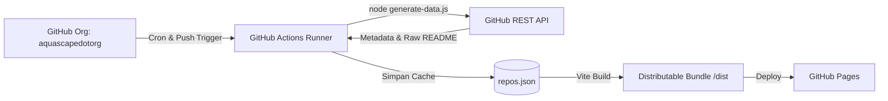

<div align="center">

# AQUASCAPE — Public Projects & Ecosystem Portal

[](https://github.com/aquascapedotorg/landing_aquascape/actions/workflows/update-repos.yml)
[](https://aquascapedotorg.github.io/landing_aquascape/)
[](https://react.dev/)
[](https://vitejs.dev/)
[](https://tailwindcss.com/)
[](https://www.typescriptlang.org/)

<p align="center">
  Portal katalog dan dokumentasi resmi untuk organisasi GitHub <a href="https://github.com/aquascapedotorg">aquascapedotorg</a>.<br>
  Menyajikan ringkasan proyek dan dokumentasi tingkat tinggi secara terpusat, terotomasi, dan aman.
</p>

</div>

---

## Tujuan Proyek

Organisasi GitHub **AQUASCAPE** mengelola repositori publik (open-source) dan internal (privat). Landing page ini dibangun untuk memenuhi kebutuhan berikut:

1. **Visibilitas Proyek Tanpa Mengekspos Kode Sumber (Privacy-Preserving Showcase)**
   - Memberikan akses publik kepada mitra, klien, dan komunitas untuk melihat katalog proyek aktif yang sedang dikerjakan organisasi.
   - Menyediakan sarana membaca dokumentasi resmi (`README.md`) dari setiap proyek langsung di web tanpa harus membuka akses ke repositori privat atau membocorkan implementasi kode internal.

2. **Sinkronisasi Otomatis Tanpa Intervensi Manual (Automated Data Pipeline)**
   - Memanfaatkan GitHub Actions terjadwal (cron) dan pemicu push.
   - Mengambil metadata dan isi README repositori organisasi secara berkala menggunakan Fine-grained Personal Access Token, lalu mem-build dan men-deploy ulang situs ke GitHub Pages secara otomatis.

3. **Identitas Visual Ekosistem Aquascape**
   - Mengintegrasikan kanvas simulasi akuarium interaktif berbasis Web Canvas API dan Web Audio API untuk merefleksikan identitas organisasi.

---

## Fitur

- **Simulasi Kanvas Aquascape (60 FPS)**
  - Simulasi pergerakan ikan maskot origami dengan algoritma kemudi (*steering behavior*).
  - Tanaman air (*Vallisneria* dan *Rotala*) dengan deformasi dinamis mengikuti arus air.
  - Partikel gelembung CO2 dan riak permukaan air.
  - Interaksi pengguna: klik pada kanvas untuk menjatuhkan pakan ikan (*food feeding*).

- **Kontrol Pencahayaan & Audio Ambient**
  - Tiga profil pencahayaan akuarium: *Daylight*, *Sunset*, dan *Night*.
  - Generator audio ambient sintesis berbasis Web Audio API (efek air dan gelembung tanpa file audio eksternal).
  - Mode Zen: tampilan akuarium layar penuh tanpa elemen antarmuka lain.

- **Katalog & Navigasi Proyek**
  - Pencarian instan berbasis teks untuk nama, deskripsi, dan topik/tags repositori.
  - Filter interaktif berdasarkan bahasa pemrograman (TypeScript, Python, HTML, CSS, dsb.).
  - Indikator status visibilitas (*Public* / *Private*).

- **In-App Markdown Reader**
  - Modal pembaca dokumen `README.md` terintegrasi menggunakan parser *GitHub Flavored Markdown* (GFM).
  - Tampilan metadata: tanggal pembaruan terakhir, link ke repositori GitHub, dan navigasi keyboard (`Esc`).

---

## Arsitektur & Alur Kerja



### Rincian Alur Kerja:
1. Workflow GitHub Actions ([`.github/workflows/update-repos.yml`](.github/workflows/update-repos.yml)) dijalankan secara berkala atau setiap ada commit di branch `main`.
2. Script [`generate-data.js`](generate-data.js) menggunakan secret `ORG_TOKEN` untuk melakukan autentikasi ke GitHub API:
   - Mengambil daftar seluruh repositori dalam organisasi `aquascapedotorg`.
   - Mengambil metadata (nama, deskripsi, topik, bahasa utama, timestamp).
   - Mengambil isi `README.md` (di-decode dari Base64).
3. Data disimpan ke `repos.json` dan disalin ke `public/repos.json`.
4. Jika terdapat perubahan data repositori, GitHub Actions bot membuat commit pembaruan data secara otomatis.
5. Vite mem-build aplikasi React ke direktori `./dist`.
6. Artefak `./dist` di-deploy ke GitHub Pages.

---

## Menjalankan Secara Lokal

### Prasyarat
- **Node.js**: versi 20.x atau 22.x+
- **NPM** atau **Bun**

### Langkah Instalasi & Menjalankan

1. Clone repositori:
   ```bash
   git clone https://github.com/aquascapedotorg/landing_aquascape.git
   cd landing_aquascape
   ```

2. Pasang dependensi:
   ```bash
   npm install --legacy-peer-deps
   # atau menggunakan Bun:
   bun install
   ```

3. Jalankan server pengembangan lokal:
   ```bash
   npm run dev
   # atau menggunakan Bun:
   bun run dev
   ```
   Aplikasi dapat diakses melalui `http://localhost:3000/`.

4. Generate data repositori secara lokal (opsional, memerlukan token GitHub):
   ```bash
   GITHUB_TOKEN=your_token_here node generate-data.js
   ```

5. Build untuk produksi:
   ```bash
   npm run build
   # atau menggunakan Bun:
   bun run build
   ```

---

## Konfigurasi GitHub Actions & Secret Token

Agar workflow otomatis dapat membaca repositori organisasi (termasuk yang berstatus privat), buat Fine-grained Personal Access Token di GitHub:

1. Buka **GitHub Settings > Developer Settings > Personal Access Tokens > Fine-grained tokens**.
2. Klik **Generate new token**.
3. Konfigurasi token:
   - **Resource owner**: `aquascapedotorg`
   - **Repository access**: *All repositories*
   - **Repository permissions**:
     - `Contents`: Read-only (untuk membaca file `README.md`)
     - `Metadata`: Read-only (untuk membaca metadata repositori)
4. Buka repositori **landing_aquascape** di GitHub.
5. Masuk ke **Settings > Secrets and variables > Actions**.
6. Tambahkan secret baru dengan nama `ORG_TOKEN` dan masukkan nilai token yang telah dibuat.

---

## Struktur Direktori

```text
landing_aquascape/
├── .github/
│   └── workflows/
│       └── update-repos.yml     # Workflow CI/CD sinkronisasi data & deploy Pages
├── public/
│   ├── static/                  # Asset grafis resmi yang disalin saat build
│   ├── logo.svg                 # Maskot SVG
│   └── repos.json               # Salinan data repositori publik
├── src/
│   ├── components/
│   │   ├── AquascapeAudio.ts    # Web Audio API ambient sound generator
│   │   ├── AquascapeCanvas.tsx  # Simulasi kanvas akuarium interaktif 60 FPS
│   │   ├── AquascapeControls.tsx# Panel kontrol pencahayaan & interaksi
│   │   ├── AquascapeLogo.tsx    # Komponen logo & banner resmi AQUASCAPE
│   │   ├── Header.tsx           # Navigasi atas, kontrol audio & mode zen
│   │   ├── Hero.tsx             # Section hero dengan banner & living tank
│   │   ├── ProjectCard.tsx      # Komponen kartu proyek & tag repositori
│   │   ├── ReadmeModal.tsx      # Modal pembaca Markdown dokumentasi
│   │   └── ZenAquariumModal.tsx # Tampilan akuarium layar penuh
│   ├── data/
│   │   └── reposData.ts         # Data cadangan (fallback) awal repositori
│   ├── App.tsx                  # Komponen utama & state management
│   ├── main.tsx                 # Entrypoint React DOM
│   ├── index.css                # Konfigurasi Tailwind CSS v4 & custom style
│   └── types.ts                 # Definisi tipe TypeScript
├── static/                      # File master grafis resmi (logo transparan, banner)
├── generate-data.js             # Script ekstraksi metadata & README via GitHub API
├── repos.json                   # Cache data repositori lokal
├── vite.config.ts               # Konfigurasi Vite & path relatif
├── tsconfig.json                # Konfigurasi TypeScript compiler
└── package.json                 # Konfigurasi dependensi dan script npm
```

---

## Lisensi & Hak Cipta

Hak Cipta (c) 2026 **AQUASCAPE** (`aquascapedotorg`). Seluruh hak cipta dilindungi undang-undang.
